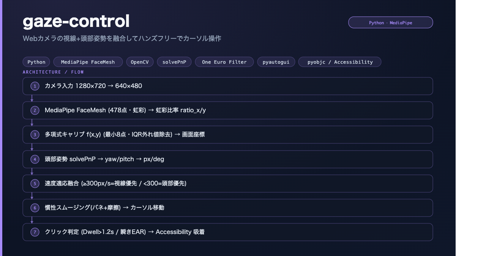
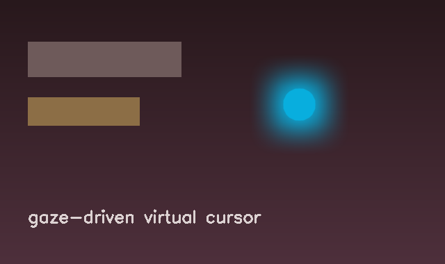

# gaze-control — 視線 + 頭部姿勢でカーソルを操作

> Webカメラだけで、視線と頭の向きを推定して Mac のマウスカーソルを動かすハンズフリー操作システム。アクセシビリティ／ハンズフリーUIの実験。

[](https://www.python.org/) [](https://opencv.org/) [](https://mediapipe.dev/)

---

## 構成図

> ※ Webカメラ入力のリアルタイム処理のため、UIスクリーンショットの代わりに処理パイプライン図を掲載。


---

## 概要

特別なハードウェア無しで、**Webカメラ映像から視線方向と頭部姿勢を推定**し、それらを融合してカーソル位置を決定する。キャリブレーションで個人差を吸収し、`accessibility_snap` で画面上のUI要素にスナップさせる工夫を持つ。

---

## 仮想カーソル（gaze駆動・実マウスと独立）

`--virtual-cursor` で、**OSの実マウスには一切触れず**、視線だけで動く「広範囲ブラーの円形カーソル」を画面に重ねて表示する。実マウスは手で今まで通り使いながら、視線カーソルを別レイヤーとして観察できる。



- 透明・クリックスルー・常時最前面のオーバーレイ（PySide6 / PyQt5）
- 描画は専用プロセスで動作し、OpenCVのメインループと衝突しない
- 座標は共有メモリ経由で受け渡し、`exp_smooth`（フレームレート非依存スムージング）で滑らかに追従
- Qt未導入・GUI不可環境では自動的に無効化（本体は通常通り動作）

```bash
python main.py --virtual-cursor                 # 仮想カーソル（表示のみ・実マウス非干渉）
python main.py --virtual-cursor --threaded-camera --debug
```

### プレビューウィンドウは既定で非表示

カメラのプレビュー窓を出すと、人はつい画面内の自分の目を見てしまい視線がそちらに引っ張られて制御が乱れる。そこで**プレビュー窓は既定で非表示**にし、カメラだけ動かす。見たい時は実行中に **`p` キーで表示/非表示をトグル**できる（`pynput` のグローバルホットキー。窓が無くても `q`/ESC で終了可能）。`--show-window` で起動時から表示、`--debug` で詳細オーバーレイ表示。

### 「ぬるっと」した追従（`smoothing.py`）

リアルタイムすぎると推定の微小なラグ・ノイズで視線が落ち着かない。`MotionStabilizer` が **注視デッドゾーン**（微小な揺れを無視して注視点を保持）＋ **間引き確定**（中間移動はフレームを削って一定間隔でのみ反映）＋ **サッケード即追従**（大きな移動はそのまま追従）で安定化し、遅れて滑る質感を作る。

### blendshape ベースの瞬き/眉上げ判定（`blendshapes.py`）

Tasks `FaceLandmarker` の表情係数（ARKit互換スコア）で、**瞬き**（`eyeBlink*` → `--blink-click`）と**眉上げ**（`browInnerUp`/`browOuterUp*` → `--precision-mode` で精密モード自動切替）を判定する。EAR や眉-目間距離の幾何計算より照明・距離・個人差に強い。blendshape が得られない環境（旧FaceMesh）では従来手法へ自動フォールバック。

---

## 構成

| モジュール | 役割 |
|---|---|
| `gaze_estimator.py` | 視線方向の推定 |
| `head_pose_estimator.py` | 頭部姿勢（向き）の推定 |
| `fusion.py` | 視線 × 頭部姿勢の融合ロジック |
| `calibration.py` | 個人差を補正するキャリブレーション |
| `cursor_controller.py` / `gaze_pointer.py` | カーソル制御 |
| `accessibility_snap.py` | UI要素へのスナップ |
| `virtual_cursor.py` | gaze駆動の仮想カーソル（広範囲ブラー円・透明オーバーレイ） |
| `camera_stream.py` | スレッド化カメラ取得（FPS底上げ） |
| `smoothing.py` | 動き安定化（注視デッドゾーン＋間引き＝「ぬるっと」追従） |
| `hotkeys.py` | グローバルホットキー（窓非表示でも終了/表示切替） |
| `blendshapes.py` | 表情係数で瞬き/眉上げを判定（EAR/幾何より頑健・自動フォールバック） |

---

## 技術スタック

`Python 3.11` `OpenCV` `MediaPipe (Tasks FaceLandmarker)` `NumPy` `PyAutoGUI` `pynput` `PySide6 (overlay)` `PyObjC (Quartz / ApplicationServices)`

---

## セットアップ

> 対応 Python: **3.9〜3.12**（3.11 推奨）。3.13 は MediaPipe の wheel が未提供のため不可。

```bash
python3.11 -m venv .venv && source .venv/bin/activate   # 3.9〜3.12 のいずれか
pip install --upgrade pip
pip install -r requirements.txt
python main.py --virtual-cursor   # 実行（カメラ権限が必要）
pytest                            # テスト
```

> ⚠️ macOS では「アクセシビリティ」「カメラ」のシステム権限が必要です。

---

## このプロジェクトで見せられること

- **コンピュータビジョン × リアルタイム制御**（推定→融合→アクチュエーション）
- **アクセシビリティ志向**のハンズフリーUI設計
- OS低レイヤ（PyObjC/Quartz）との連携

---

*※ ポートフォリオ目的の公開リポジトリです。*
